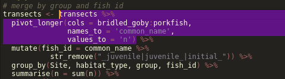
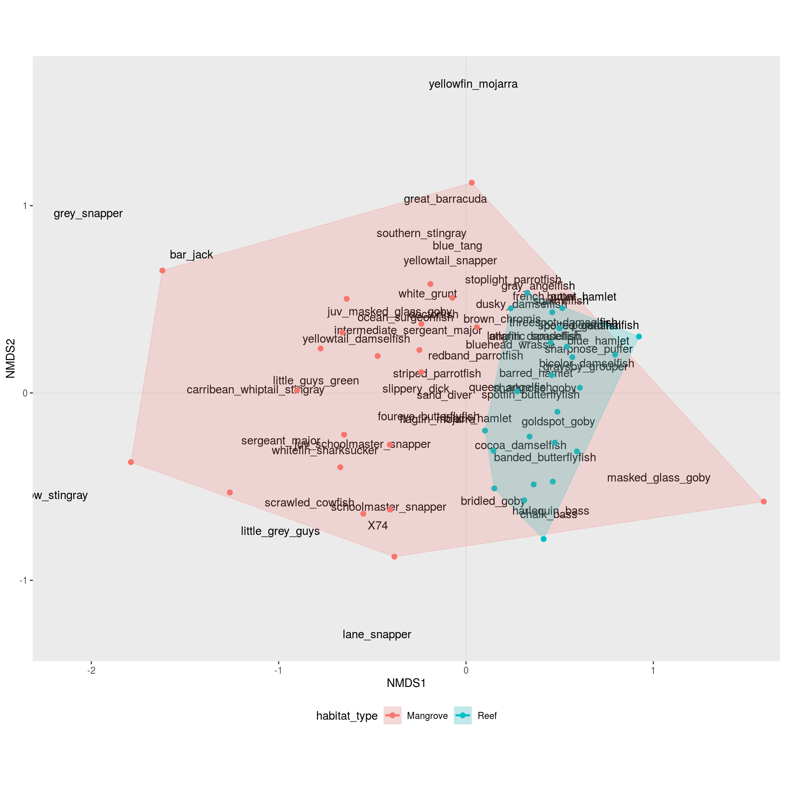
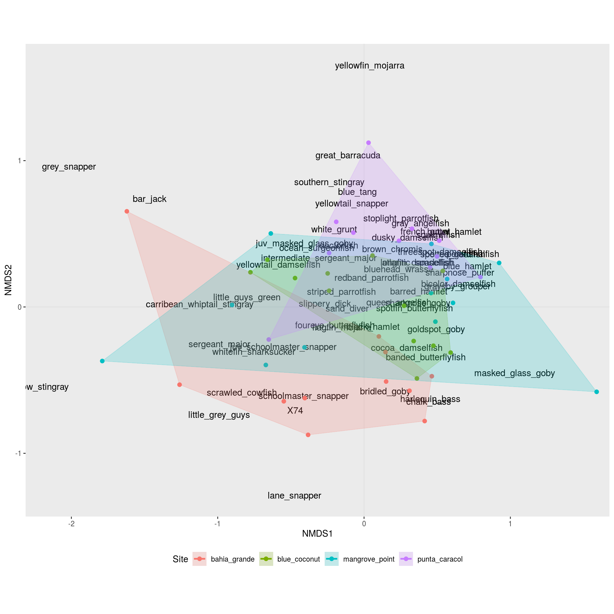
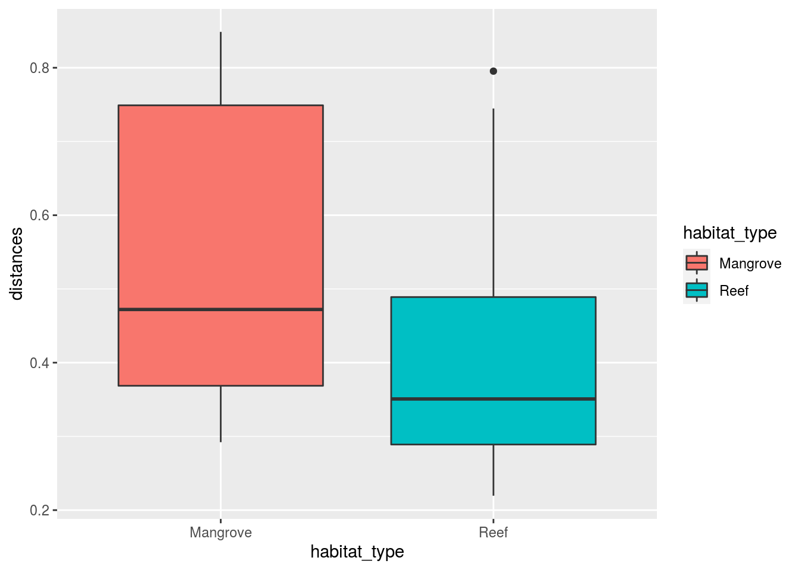

# nMDS and Permanova

## External pacakges

The script starts by loading all needed libraries.
(Technically, the package lubridate is not important, I only used it to propperly format the date column, but the information is never used... )


```r
# loading all needed libraries
# -----------------------------------
library(tidyverse)
library(ggalt)
library(vegan)
library(lubridate)
```

## Custom functions

To make the code mode easily understandable (hopefully), we define some helper functions upfront (as opposed to "in the middle of the process"):

At some point we will need to fill the empty celly of our data sheet with zeros - by default R will fill empty cells with `NA`.
For this we create a function, that will replace `NA` in all columns of a data frame except for a specific subset of columns (the "non-fish" columns).


```r
# setting up custom functions
# -----------------------------------
# funtion to fill empty cells (NA) with zeros 
replace_all_na <- function(tib, replace = 0,
                           exclude = c("Date", "location", "group",
                                       "habitat_type", "depth")){
  
  # get all fish columns ("non-non-fish-columns") 
  nm_replace <- names(tib)[!(names(tib) %in% exclude)]
  
  # create a replacement list in the form of: list(fish_1 = 0, fish_2 = 0, ...)
  replace_list <- rep(replace,length(nm_replace)) %>% 
    set_names(nm = nm_replace) %>%
    as.list()
  
  # apply replacement list
  tib %>% replace_na(replace = replace_list)
}
```

To make plotting the nMDS results with ggplot a little easier, we create a export function that will take the nMDS results as input and return a list with two data sets (`output_name$spots` - the transect scores and `output_name$species` - the species "influence").


```r
# funtion to export nmds results for plotting with ggplot
export_nmds <- function(tib, nmds, score_name = "Spot", species_name = "Species"){
  # doublecheck that rownames are uniqe,
  # otherwise the merge at the end duplicates entries 
  if(any(duplicated(rownames(scores(nmds))))){
    stop(paste("Sorry, the rownames of the distance matrix need to be unique.
               Currently that is not the case:\n\n ", 
               paste(c('!',' ')[2 - (duplicated(rownames(scores(nmds))) | duplicated(rownames(scores(nmds)),
                                                                                     fromLast = TRUE))],
                     rownames(scores(nmds)),
                     collapse = '\n  ')))
  }
  
  # export obesravtions in nMDS space
  data_scores <- as.data.frame(scores(nmds)) %>% 
    as_tibble(rownames = score_name)
  # export species in nMDS space
  data_species <- as.data.frame(scores(nmds, "species"))%>% 
    as_tibble(rownames = species_name)
  
  list(spots = tib %>% left_join(data_scores),
       species = data_species)
}
```

## Loading data

Now, we are all set up and can start with the actual work.

First, we need to import the survey data into R.

Directly while importing we deal with some issues:

- we extract the *pure* site name from the `location` column (dropping the `_mangrove` suffix)
- we proppely format the date (actually transforming the column from `character` into `date`-type)
- since we have several transects per group, we number the transects within each group
- from the columns `Site`, `habitat_type`, `group` and `transet_nr_within_group` we create a unique identifier for each transect
- finally, we use the previously prepared function to replace all empty fish-cells with zeros

<p style='color:#f0a830'>Beware of the `col_types = str_c(c('ccdc',rep('d', 78)),collapse = '')` part: here we define the column types (c = character, d = "double"/number). So I the original google sheet changes (eg. by a merge og "blue hamlet" and "black hamlet") the `78` needs to be updated to *the total number of columns* - 4!</p>


```r
# ----------------------------------
# the actual script
# -----------------------------------
  
# reading in the transect data and replacing NAs with zeros
transects <- read_tsv('data/Fish_surveys - Sheet1.tsv',
                      col_types = str_c(c('ccdc',rep('d', 78)),collapse = '')) %>%
  # we need unique identifiers for each transect,
  # so we are going to assign a transet_nr_within_group 
  group_by(location, group) %>%
  mutate(Site = location %>% str_to_lower() %>% str_remove('_mangrove'),
         transet_nr_within_group  = row_number(),
         Date = Date %>%
           str_replace(pattern = "([0-9]*)/([0-9]*)/([0-9]*)",
                       replacement = "\\3-\\1-\\2") %>%
           as_date(Date),
         Transect_id = str_c(Site, habitat_type, group,
                             transet_nr_within_group ,sep = '_')) %>%
  ungroup() %>%
  replace_all_na()
```

```
## Warning: Missing column names filled in: 'X74' [74]
```


After a first check, I realised that we will need to merge the observations within each group (eg. line 2 & 3 or line 4 & 5 of the original google sheet) - here we merge several rows of the data set.

We also need to merge the observations over different stages (eg. juvenile_bluehead_wrasse & bluehead_wrasse) - here we merge several columns.

To do this merging we are going to apply some tidyverse-magic (using functions from the packages [tidyr](https://tidyr.tidyverse.org/) and [dplyr](https://dplyr.tidyverse.org/)).

If you have difficulties following these rather complex steps, it might be helpful to highlight and execute just parts of the code (to see what is going on you will allways need to start with `transects %>%` and NOT highlight the `transects <- ` bit):




```r
# merge by group and fish id
transects <- transects %>%
  # transfrom the data from "wide" into "long" format
  # note that we select the fish columns here, so the bridled_goby:porkfish
  # part might need to be updated if the google cheet changes to the
  # form of fist_fish:last_fish
  pivot_longer(cols = bridled_goby:porkfish,
               names_to = 'common_name',
               values_to = 'n') %>%
  # create a new column with the fish species (irrespective of stage)
  mutate(fish_id = common_name %>% 
           str_remove("_juvenile|juvenile_|initial_")) %>% 
  # set the logic to summarise over (we want one entry per species
  # for every site, habitat_type and group)
  group_by(Site, habitat_type, group, fish_id) %>%
  # summ the counts according to our grouping
  summarise(n = sum(n)) %>%
  # remove the grouping (the effect of this is not visible,
  # but if we don't do this the data table might behave strange later on..)
  ungroup() %>%
  # reformat back to wide format (note that now the species are sorted alphabetically)
  pivot_wider(names_from = fish_id,
              values_from = n) %>%
  # Since we now have only a single entry per group,
  # we update our transect identifiers
  mutate(Transect_id = str_c(Site, habitat_type, group, sep = '_'))
```

For some reason, some transects are completely empty (0 for all species).
These are not informative in terms of community composition and need to be dropped from the data table (otherwise the nMDS will fail because there is no way to compute ecological distances with those transects).
To check for this, we create a new column with the sum of all fish for each transect.


```r
transects <- transects %>%
  mutate(total_count = transects %>% 
           rowwise() %>% 
           select(-(Site:group),-Transect_id) %>%
           rowSums())
```

Now we filter all transects that have a total count of zero.


```r
transects <- transects %>%
  filter(total_count != 0)
```

## Run nMDS

So far, we have worked with our data in the format of a `data.frame`, yet the nMDS expects a `matrix` (this just some internal stuff in R that has to do with the data stucture and you don't rally have to worry about...).

To prepare the nMDS input we select only the fish columns (<span style='color:#f0a830'>note that the column order has changed and the fish are now sorted alphabetically</span>) and convert these columns into a matrix.

We store the transect ids in the `rownames` of the matrix (this is no data *within* the matrix and hence not considdered for the analysis).


```r
data_matrix <- transects %>%
  select(atlantic_spadefish:yellowtail_snapper) %>%
  as.matrix()

rownames(data_matrix) <- transects$Transect_id
```

Now we can run the nMDS on our data and export the results for ggplot.


```r
data_nmds <- metaMDS(data_matrix, k = 2, trymax = 999, distance='bray')
```

```
## Square root transformation
## Wisconsin double standardization
## Run 0 stress 0.2054951 
## Run 1 stress 0.2125691 
## Run 2 stress 0.2110124 
## Run 3 stress 0.2089351 
## Run 4 stress 0.2072644 
## Run 5 stress 0.2089023 
## Run 6 stress 0.208936 
## Run 7 stress 0.217789 
## Run 8 stress 0.2061955 
## Run 9 stress 0.2168443 
## Run 10 stress 0.2076921 
## Run 11 stress 0.2084392 
## Run 12 stress 0.2244283 
## Run 13 stress 0.2177622 
## Run 14 stress 0.2133883 
## Run 15 stress 0.2115299 
## Run 16 stress 0.2159872 
## Run 17 stress 0.2267195 
## Run 18 stress 0.2111826 
## Run 19 stress 0.2069518 
## Run 20 stress 0.2069526 
## Run 21 stress 0.2228818 
## Run 22 stress 0.2133022 
## Run 23 stress 0.2133641 
## Run 24 stress 0.216247 
## Run 25 stress 0.2054938 
## ... New best solution
## ... Procrustes: rmse 0.0004744987  max resid 0.001909102 
## ... Similar to previous best
## *** Solution reached
```

```r
# you can also try plot(data_nmds) at this point
data_nmds_results <- export_nmds(transects, data_nmds, score_name = 'Transect_id')
```

```
## Joining, by = "Transect_id"
```

To look at the results we plot the exported data and color by habitat type:


```r
p1 <- ggplot(data_nmds_results$spots,
       aes(x = NMDS1, y = NMDS2,
           group = habitat_type)) + 
  # nMDS needs equal axis
  coord_equal() +
  # add lines for x = 0 and y = 0
  geom_hline(yintercept = 0, color = 'lightgray', alpha = .4) +
  geom_vline(xintercept = 0, color = 'lightgray', alpha = .4) +
  # add indication of species influence
  geom_text(inherit.aes = FALSE,
            data = data_nmds_results$species,
            aes(x = NMDS1, y = NMDS2, label = Species)) +
  # add scoring of the transects
  geom_point(aes(colour = habitat_type), size = 2) +
  # add the outer hull for each habitat type
  geom_encircle(aes(colour = habitat_type, fill = habitat_type), 
                s_shape = 1, alpha = 0.2, size = 1, expand = 0)+
  # add a little space on either side of the plot (for text)
  scale_x_continuous(expand = c(.01,.05))+
  # adjust plot layout
  theme(legend.position = 'bottom',
        panel.grid = element_blank())

# print plot
p1
```

```
## Warning: Removed 1 rows containing missing values (geom_text).
```



Alternatively we can highlight the differnt sites using color.

Note that all that has changed here is several replacements from `colour = habitat_type` to `colour = Site` - same for `fill =`.


```r
p2 <- ggplot(data_nmds_results$spots,
       aes(x = NMDS1, y = NMDS2,
           group = Site)) + 
  # nMDS needs equal axis
  coord_equal() +
  # add lines for x = 0 and y = 0
  geom_hline(yintercept = 0, color = 'lightgray', alpha = .4) +
  geom_vline(xintercept = 0, color = 'lightgray', alpha = .4) +
  # add indication of species influence
  geom_text(inherit.aes = FALSE,
            data = data_nmds_results$species,
            aes(x = NMDS1, y = NMDS2, label = Species)) +
  # add scoring of the transects
  geom_point(aes(colour = Site), size = 2) +
  # add the outer hull for each site
  geom_encircle(aes(colour = Site, fill = Site),
                s_shape = 1, alpha = 0.2, size = 1, expand = 0)+
  # add a little space on either side of the plot (for text)
  scale_x_continuous(expand = c(.01,.05))+
  # adjust plot layout
  theme(legend.position = 'bottom',
        panel.grid = element_blank())

# print plot
p2
```

```
## Warning: Removed 1 rows containing missing values (geom_text).
```



we can export these plots using `ggsave()`.


```r
ggsave(filename = 'nmds_by_haitat_type.pdf', plot = p1, width = 9, height = 9)
ggsave(filename = 'nmds_by_site.pdf', plot = p2, width = 9, height = 9)
```

## Permanova

We can gain som insight from the nMDS plots, but if we want to check if the clusters on the nMDS are actually significantly differnt, we need to run a Permanova.

The Permanova is also based on ecological differnces between the transects (just like nMDS), but here we need to compute the ourselves (nMDS does this step internally).


```r
# Permanova ------------------
# compute ecological distances between the transects
distances <- vegdist(data_matrix, 
                     distance = 'bray')

# export the hapitat types according to order of the distance matrix
distances_groups <- transects[match(labels(distances),
                                       transects$Transect_id),]$habitat_type
```

One point we unfortunately could not discuss in class (because of time 😭), is the fact that like many other statistical tests, Permanova also has some assumptions about our data.

So, before we start, we need to check if the assumptions for permanova are met by our data [@Anderson01]:

<center> *"The only assumption of the test is that [...] the observations are independent and that they have similar distributions"*</center>

This means that our data should be *homogeneous dispersed* - our clusters should be of  approximately equal size (similar to equal variances when running an ANOVA or a t-test).
The idea here is that if the clusters are of differnt sizes, the permanova might give a significant result because of the size diffence and not because of a difference in location of the clusters on the nMDS.

To check for homogeneous dispersion, we can either use a statistical test (permutation test) or visualize the dispersion.


```r
# For the test for homogeneous dispersion we nee to compute the
# distance of each transect to the center of its respective cluster
# (s. https://k-hench.github.io/nmds/nmds.html#9 )
distances_betadispersion <- betadisper(distances, 
                                       distances_groups)

# test homogenous dispersion
permutest(distances_betadispersion) 
```

```
## 
## Permutation test for homogeneity of multivariate dispersions
## Permutation: free
## Number of permutations: 999
## 
## Response: Distances
##           Df Sum Sq  Mean Sq      F N.Perm Pr(>F)  
## Groups     1 0.1401 0.140096 4.0667    999  0.048 *
## Residuals 44 1.5158 0.034449                       
## ---
## Signif. codes:  0 '***' 0.001 '**' 0.01 '*' 0.05 '.' 0.1 ' ' 1
```

Here, we hope for a p-value larger than 0.05, since a value smaller than 0.05 would tell us that the dispersions of our clusters are indeed differnt (that the clusters are of different size).

We can also inspect the distances of all transects to the center of their respective cluster visually for the same inforamtion:


```r
tibble(distances = distances_betadispersion$distances,
       habitat_type = distances_betadispersion$group) %>%
  ggplot(aes(x = habitat_type, y = distances, fill = habitat_type))+
  geom_boxplot()
```



At the stage when I checked the data it looked like our data is very borderline - actually the clusters for mangrove and reef seem to be of different sizes.

Fortunately the author of permanova basically told people to chill in such situations as long as their experimantal design was balanced [@Anderson13]:

<center> *"In contrast, PERMANOVA and Pillai’s trace were largely unaffected by heterogeneity for balanced designs"*</center>

So, lets quickly doublecheck:


```r
transects %>%
  group_by(habitat_type) %>%
  count()
```

```
## # A tibble: 2 x 2
## # Groups:   habitat_type [2]
##   habitat_type     n
##   <chr>        <int>
## 1 Mangrove        22
## 2 Reef            24
```

To me 22/24 seems reasonably balanced, so we finally run the permanova: 


```r
data_permanova <- adonis(formula = distances ~ distances_groups,
                         permutations = 999, method = 'bray')

print(data_permanova) 
```

```
## 
## Call:
## adonis(formula = distances ~ distances_groups, permutations = 999,      method = "bray") 
## 
## Permutation: free
## Number of permutations: 999
## 
## Terms added sequentially (first to last)
## 
##                  Df SumsOfSqs MeanSqs F.Model      R2 Pr(>F)    
## distances_groups  1    3.9133  3.9133  14.904 0.25302  0.001 ***
## Residuals        44   11.5528  0.2626         0.74698           
## Total            45   15.4660                 1.00000           
## ---
## Signif. codes:  0 '***' 0.001 '**' 0.01 '*' 0.05 '.' 0.1 ' ' 1
```

At this point it is up to you to interpret the results - as far as stats go we're done.
