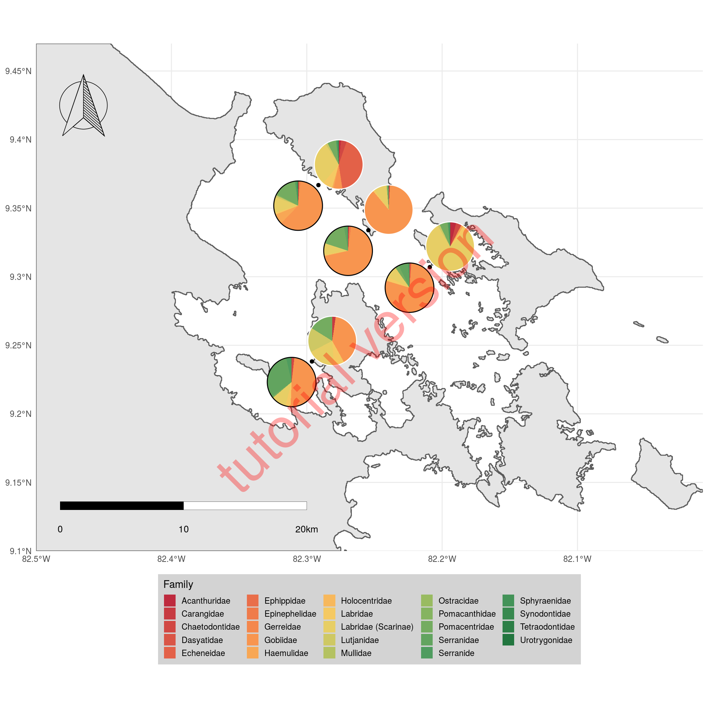

# pie-charts on map


## External pacakges

Note that we need to drop the following entries unless you know their family:

- little_grey_guys
- little_guys_green

Also, the following species need to be added to the fish list:

- flagfin_mojarra
- grey_snapper
- bearded_toadfish
- blue hamlet (unless changed to black hamlet)

The script starts by loading all needed libraries.


```r
# loading all needed libraries
# -----------------------------------
library(tidyverse)
# for maps
library(sf)
# for pies on maps
library(scatterpie)
# for colors
library(paletteer)
# for scalebar
library(ggsn)
# for loading the compass image
library(hypoimg)
```

```
## --- Welcome to hypoimg ---
```

```r
# for circles around pies
library(ggforce)
# to format dates
library(lubridate)
# for horizontal barplot
library(ggstance)
```

## Custom functions

To make the code more easily understandable (hopefully), we define some helper functions upfront (as opposed to "in the middle of the process"):

The shapefile that we downloaded from [gdam.org](https://www.gadm.org/download_country_v3.html) contains whole Panama, but we are only going to plot Bocas del Toro.
Therefore we define a function to crop the shapefile to the extent of the map.


```r
# setting up custom functions
# -----------------------------------

# function to crop shapefiles to plot extent 
crp <- function (poly, xlim = xlim_boc, ylim = ylim_boc) {
  st_intersection(poly, 
                  st_set_crs(st_as_sf(as(raster::extent(xlim[1],
                                                        xlim[2],
                                                        ylim[1],
                                                        ylim[2]), 
                                         "SpatialPolygons")),
                             st_crs(poly)))
}
```

To plot the sampling pointswe turn the `data.frame` into a spatial object (strictly this is not necessary since the projection of our map is WGS - the same as GPS uses, but it might be good to know how to do this propperly...).


```r
# function to turn a data.frame (with the columns
# "Longitude" and "Latitude") into a spatial object
tibble_to_sf <- function(tib, crs = 4326){
  tib %>%
    st_as_sf(., coords = c("Longitude","Latitude")) %>%
    st_set_crs(., crs)
}
```

At some point we will need to fill the empty celly of our data sheet with zeros - by default R will fill empty cells with `NA`.
For this we create a function, that will replace `NA` in all columns of a data frame except for a specific subset of columns (the "non-fish" columns).


```r
# funtion to fill empty cells (NA) with zeros 
replace_all_na <- function(tib, replace = 0, exclude = c("Date", "location", "group",
                                                         "habitat_type", "depth")){
  nm_replace <- names(tib)[!(names(tib) %in% exclude)]
  replace_list <- rep(replace,length(nm_replace)) %>% 
    set_names(nm = nm_replace) %>%
    as.list()
  
  tib %>% replace_na(replace = replace_list)
}
```

## Loading data

Now, we are all set up and can start with the actual work.

First, we need to set the extent of the map and import all the data sheets into R.


```r
# -----------------------------------
# the actual script
# -----------------------------------

# setting the extent of the map
xlim_boc <- c(-82.5, -82)
ylim_boc <- c(9.1, 9.47)
```

Next, we import the Panama shapefile and crop it to the map extent.


```r
# reading the panama shape files and
# cropping it to the plot extent
# (downloaded from https://www.gadm.org/download_country_v3.html)
bocas <- read_sf('data/PAN_adm0.shp') %>%
  crp()
```

Then we load all de diving sites and remove duplicated entries (we only need each position once).


```r
# reading in the dive sites for the gps locations
sites <- read_tsv('data/dive_spots - Sheet1.tsv') %>%
  filter(!duplicated(Site)) %>%
  select(Site, Latitude, Longitude)
```

Then, we import the survey data into R.

Directly while importing we deal with some issues:

- we extract the *pure* site name from the `location` column (dropping the `_mangrove` suffix)
- we proppely format the date (actually transforming the column from `character` into `date`-type)
- since we have several transects per group, we number the transects within each group
- from the columns `Site`, `habitat_type`, `group` and `transet_nr_within_group` we create a unique identifier for each transect
- finally, we use the previously prepared function to replace all empty fish-cells with zeros

<p style='color:#f0a830'>Beware of the `col_types = str_c(c('ccdc',rep('d', 78)),collapse = '')` part: here we define the column types (c = character, d = "double"/number). So I the original google sheet changes (eg. by a merge og "blue hamlet" and "black hamlet") the `78` needs to be updated to *the total number of columns* - 4!</p>


```r
# reading in the transect data, replacing NAs with zeros
# and merge with gps positions
transects <- read_tsv('data/Fish_surveys - Sheet1.tsv',
                      col_types = str_c(c('ccdc',rep('d', 78)),collapse = '')) %>%
  mutate(Site = location %>% str_to_lower() %>% str_remove('_mangrove'),
         Date = Date %>%
           str_replace(pattern = "([0-9]*)/([0-9]*)/([0-9]*)",
                       replacement = "\\3-\\1-\\2") %>%
           as_date(Date)) %>%
  replace_all_na() %>%
  left_join(sites)
```

We create a copy of the survey data, extract each sampling point once, and turn dete data set into spatial objects (the sampling spots of the transects). 


```r
# create a spatial object from the transects
transects_sf <- transects %>%
  filter(!(duplicated(Site))) %>%
  select(Site:Longitude) %>%
  tibble_to_sf()
```

Then we import the fish list to be able to add familiy names to the transect data.


```r
# reading in the fish list for the fish families and create an ID column
# for merging with the transect data
fish_list <- read_tsv('data/Fish_list_2020 - Sheet1.tsv') %>%
  select(Common_name:`Family (latin name)`) %>%
  # format the fish id column which is going to be
  # used for the merging with the transect data
  mutate(fish_id = Common_name )
```

```
## Parsed with column specification:
## cols(
##   Common_name = col_character(),
##   `Latin name` = col_character(),
##   `Family (common name)` = col_character(),
##   `Family (latin name)` = col_character(),
##   Phase = col_character(),
##   Abundance = col_character(),
##   `Date (YYYY-MM-DD)` = col_character(),
##   Comments = col_character(),
##   Observer = col_character(),
##   Checked = col_character()
## )
```

We are going to plot two pies per sampling spot (one per habitat type), so here we define the offset width between them (which will also determine the pie size).


```r
# pie shift is set to define the distance between
# the "mangrove" and "reef" pie for each location 
pie_shift <- .03
```

## Merge and summarize data

Now is the time to merge the trasect data and the fish list.

To do this merging (again) we are going to apply some tidyverse-magic (using functions from the packages [tidyr](https://tidyr.tidyverse.org/) and [dplyr](https://dplyr.tidyverse.org/)).

If you have difficulties following these rather complex steps, it might be helpful to highlight and execute just parts of the code (to see what is going on you will allways need to start with `transects %>%` (s. explanation of nmds).


```r
# merge transect data and fish list
summary_by_family <- transects %>%
  # we need unique identifiers for each transect,
  # so we are going to assign a transet_nr_within_group 
  group_by(location, group) %>%
  mutate(transet_nr_within_group  = row_number(),
         transect_id = str_c(location, group,
                             transet_nr_within_group,
                             sep = '_')) %>%
  ungroup() %>%
  # then we transform the data into "long format" to be able
  # to merge the family names based on the common name
  pivot_longer(cols = bridled_goby:porkfish,
               names_to = 'common_name') %>% 
  # from the common name we create a fish id that is in the EXACT same
  # format as the fish id column of the fish list data frame
  # (this requires some reformating, eg. dropping '_juvenile')
  mutate(fish_id = common_name %>% 
           str_remove("_juvenile|juvenile_|initial_|intermediate_|juv_"))  %>%
  # merge with the fish list
  left_join(fish_list) %>% 
     # filter(!duplicated(fish_id)) %>%
     # View()
  # drop all row that do not have an entry in the
  # fish list (typos & missing)
  filter(!is.na(`Latin name`)) %>%
  # sum the count for each family at each habitat type of each location
  group_by(`Family (latin name)`, Site, habitat_type) %>%
  summarise(n = sum(value), Latitude = Latitude[[1]], Longitude = Longitude[[1]]) %>%
  # transform back into "wide format"
  pivot_wider(names_from = `Family (latin name)`, values_from = n) %>%
  # adjust positions of pies
  mutate(grp = str_c(Site, habitat_type, sep = '_'),
         Longitude = ifelse(habitat_type == 'Reef', Longitude - .5 * pie_shift, Longitude + .5 * pie_shift),
         Latitude = ifelse(habitat_type == 'Reef', Latitude - .5 * pie_shift, Latitude +  .5 *pie_shift))
```

```
## Joining, by = "fish_id"
```

Since we are going to need this inforamtion several times downstream, we are extracting the names of all families within the transects.


```r
# select the names of all present fish families
fish_columns <- names(summary_by_family)[!(names(summary_by_family) %in%
                                             c("Date", "Site", "habitat_type", "Latitude",
                                               "Longitude", "grp"))]
```

Now, we set te color scheme for the habitat type (for the circles around the pies).


```r
# set color coding for habitat type
clr_habitat <- c(rgb(0,0,0), rgb(1,1,1)) %>% 
  set_names(nm = c('Reef', 'Mangrove'))
```

To put the compass on the map we read the svg file into R.


```r
# import the compass image
compass <- hypo_read_svg('north.svg')
```

## Plotting


```r
# -----------------------------------
# plotting the map
# -----------------------------------

# initalize the plot
ggplot()+
  # add the panama coastline
  geom_sf(data = bocas)+
  # add the sampling sites (as dots)
  geom_sf(data = transects_sf)+
  # add the pies
  geom_scatterpie(aes(x = Longitude, y = Latitude ,
                      r = .6 * pie_shift , group = grp),
                  data = summary_by_family, color = rgb(1,1,1,0),
                  cols = fish_columns) +
  # add a color coded ring around the pie to indicate habitat type
  geom_circle(data = summary_by_family,
              aes(x0 = Longitude, y0 = Latitude ,
                  r = .6 * pie_shift, color = habitat_type )) +
  # add the scalebar
  scalebar(x.min = -82.5, x.max = -82.3,
           y.min = 9.13, y.max = 9.17,transform = TRUE,
           dist = 10, dist_unit = "km",
           st.dist = .35, st.size = 3.5,
           border.size = .1, height = .15)+
  # add the compass
  annotation_custom(grob = compass,
                    xmin = -82.49, xmax = -82.44,
                    ymin = 9.4, ymax = 9.45)+
  # set the color palette for the pies
  scale_fill_manual(values = paletteer_c(n = length(fish_columns),
                                         palette = "ggthemes::Red-Green-Gold Diverging"))+
  # set the color palette for the habitat types
  scale_color_manual(values = clr_habitat, guide = FALSE
                     )+
  # remove any "extra space" on the x and y axis
  scale_x_continuous(expand = c(0,0))+
  scale_y_continuous(expand = c(0,0))+
  # foramt the legend
  guides(fill = guide_legend(title = 'Family',
                             title.position = 'top'))+
  # twaek the plot appearance
  theme_minimal() +
  theme(axis.title = element_blank(),
        legend.key.size = unit(14,'pt'),
        legend.key.height = unit(14,'pt'),
        legend.background = element_rect(fill = 'lightgray', 
                                         color = rgb(1,1,1,0)),
        legend.position = 'bottom')
```



## Horizontal bar plots


```r
summary_by_family %>%
  pivot_longer(cols = Acanthuridae:Urotrygonidae,
               names_to = 'Family', values_to = 'n') %>%
  ggplot(aes(y = fct_reorder(Family, n), x = n, fill = Family))+
  geom_barh(stat = 'identity')+
  facet_grid(habitat_type ~ Site)+
  scale_fill_manual(values = paletteer_c(n = length(fish_columns),
                                         palette = "ggthemes::Red-Green-Gold Diverging"))+
  guides(fill = guide_legend(title = 'Family',
                             title.position = 'top',nrow = 3))+
  theme_minimal() +
  theme(axis.title = element_blank(),
        legend.key.size = unit(14,'pt'),
        legend.key.height = unit(14,'pt'),
        legend.background = element_rect(fill = 'lightgray', 
                                         color = rgb(1,1,1,0)),
        legend.position = 'bottom')
```


