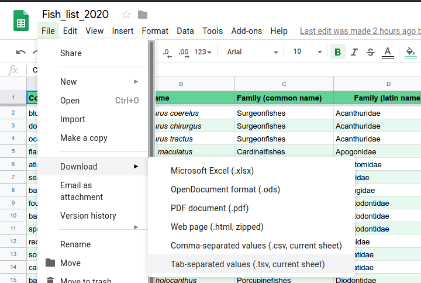

```{r setup, include=FALSE}
knitr::opts_chunk$set(echo = TRUE,
                      comment = "#>",
                      collapse = TRUE)
```

# Intro

## Before you start

For the scripts to work, the several R packages need to be installed.

For the nMDS and Permanova script you'll need:

```{r, eval = FALSE}
install.packages("tidyverse")
install.packages("ggalt")
install.packages("vegan")
install.packages("lubridate")
```

For the maps with pie-charts the following additional packages are used:

```{r, eval = FALSE}
install.packages("sf")
install.packages("scatterpie")
install.packages("paletteer")
install.packages("ggforce")
install.packages("ggsn")
install.packages("devtools")
install.packages("ggstance")
devtools::install_github("k-hench/hypoimg")

```

Also note that at the time of writing, there are still several issues with the transect google sheet:

- cell U1 states "8" when it should contain a species name (I think "juvenile_dusky_damselfish")
- cell BV1 is empty when it should contain a species name (note that currently the label of BU1 runs into BV1, group 1 & 2 added counts - so they should know what species this is...)
- I am 99% sure that the counts of the "blue hamlet" are actually black hamlets (otherwise add the blue hamlet to the fish list)

## Data structure

The scripts expect a folder called "data" within your project folder containing the following files:

```
data/
├── dive_spots - Sheet1.tsv
├── Fish_list_2020 - Sheet1.tsv
├── Fish_surveys - Sheet1.tsv
├── PAN_adm0.dbf
├── PAN_adm0.prj
├── PAN_adm0.sbn
├── PAN_adm0.sbx
├── PAN_adm0.shp
└── PAN_adm0.shx 
```

The data sheets (dive spots, fish list & fish survey) were all exported from google sheets as tsv files:



The `PAN_admn0.*` files are only needed for the map to plot the coast line of Panama.
They were downloaded from [gdam.org](https://www.gadm.org/download_country_v3.html).
